# Sibyl.ai — Strategy Overview

---

## 1. The Strategy Logic

Sibyl runs a quantitative bracket-trading strategy — no LLM for signal generation. At every 60-second cycle, it fetches live BTC/ETH/SOL/XRP prices from Hyperliquid (1-second WebSocket stream), maps them against all active Kalshi bracket markets, and computes expected value using a normal-distribution model (σ scaled by time-to-expiry). A signal is emitted when: EV > 0.5%, confidence ≥ 60%, and the bracket price clears the timeframe-specific entry floor (5c for 15-min brackets, 30c for weekly). The system selects YES if the bracket is underpriced relative to the model, NO only if the premium exceeds 50c.

---

## 2. The Tech Stack

Python 3.14 async application using the Kalshi REST API directly (custom client). Core execution flow:

```
Hyperliquid WebSocket (1s price stream)
  → SQLite DB (market + price state)
  → Signal Pipeline (60s cycle, normal-distribution bracket model)
  → Kelly Sizer (per-timeframe fraction, 7–12% of available capital)
  → Taker Market Order (Kalshi REST API)
  → Position Lifecycle Manager (stop guard, EV monitor, time-based exit)
```

Runs on a local Windows machine (EPYC 7532 homelab). No GPT/LLM in the trading hot path. Fully config-driven via YAML. Launched via `python -m sibyl --mode live --agents all`.

---

## 3. Risk Parameters

| Parameter | Value | Notes |
|-----------|-------|-------|
| Entry price floor | 5c–30c (by timeframe) | 5c for 15-min, 10c hourly, 15c daily, 30c weekly/monthly |
| Entry price ceiling | 93c | Above this, no counterparty interest |
| Kelly fraction | 7–12% of available capital | Lower for shorter timeframes |
| Max contracts per trade | 5–15 (by entry price) | 15 contracts at ≤20c entry, 5 at ≥85c entry |
| Per-market exposure cap | 5% of engine capital | Prevents single-market concentration |
| NO minimum premium | 50c | Rejects short positions with thin margin |
| Category circuit breaker | −25% drawdown | Halts all new entries for that category |
| Fee recovery threshold | 2× roundtrip fee | Edge must exceed 2.8% net to trade |

---

## 4. Performance Data

**Deposit:** $191.69 | **Current balance:** ~$100 | **All-time return:** −$91.76 (−47.9%)

| Test | Sprint | Duration | Session P&L | Primary Loss Driver |
|------|--------|----------|-------------|---------------------|
| LT2 | 22.5 | 2h 5m | −$0.81 | Market discovery gap — 97% of markets invisible to DB |
| LT3 | 24 | 37m | −$7.43 | XRP monthly bracket: 116 contracts accumulated, −$14.24 |
| LT4 | 26 | 1h 0m | ~−$6.00 | Fee drag; losses from LT3 positions settling |
| LT5 | 28 | 2h 34m | −$16.07 | 50c entry floor blocked all intraday markets; $5 payout cap |

**Cumulative fees across all tests:** $29.35 (32% of total losses)

### Illustrative Losing Trade (LT5)

**Market:** `KXBTCD-26APR0317-T85000` (BTC below $85K by Friday close)
**Side:** NO at 82c entry (18c premium paid)
**Size:** 5 contracts — $4.10 cost
**Outcome:** BTC stayed below $85K → market resolved YES → NO position expired worthless
**Loss:** −$4.10 entry + −$0.06 fees = **−$4.16**

The NO premium gate was intended to block entries with premium < 50c. At 18c premium, this trade should have been rejected — but the gate logic was comparing the wrong value, allowing it through. This is a known bug flagged for Sprint 29 remediation.

### Structural Bottleneck Identified (LT5)

The 50c flat entry floor — set in Sprint 28 to avoid negative-EV longshots — inadvertently blocked **97% of available crypto markets**. Intraday BTC brackets average 2.4c per contract; the floor eliminated all 15-minute, hourly, and end-of-day markets. Sibyl was left trading only Friday close and monthly brackets, limiting resolution events to 1–2 per week instead of 24–96 per day. This is the single largest bottleneck to capital compounding.

**Sprint 29 fix:** Tiered entry floor by timeframe (5c for 15-min, 30c for weekly) and dynamic contract caps by entry price (up to 15 contracts at low-price entries). These changes were implemented and verified — 498 tests passing, 0 regressions.

---

## 5. End-to-End Pipeline Diagram

```mermaid
graph TD

%% ── EXTERNAL SOURCES ──────────────────────────────────────────────
subgraph EXT["External APIs & Data Sources"]
    direction LR
    KALSHI_API["Kalshi Trading API v2\nRSA-PSS auth • REST\nmarkets · prices · orderbook\nportfolio · orders"]
    HL_API["Hyperliquid Info API\nREST polling\nBTC · ETH · SOL · XRP\nspot prices · L2 book · candles"]
    DATA_APIS["Category Data APIs\nFRED/BLS/BEA · ESPN/TheSportsDB\nOpen-Meteo/NOAA · CoinGecko/FearGreed\nTMDB/Wikipedia · FMP/SEC\nGDELT/Congress · ClinicalTrials/OpenFDA"]
    RESEARCH_APIS["Research APIs\nPerplexity AI (LLM synthesis)\nX/Twitter (tweet sentiment)\nReddit/NewsAPI (sentiment)"]
    NTFY["ntfy.sh\nPush Notifications"]
end

%% ── ENTRY POINT ───────────────────────────────────────────────────
subgraph ENTRY["Entry Point — sibyl/__main__.py"]
    BOOT["1  Load all YAML configs + .env credentials\n2  Initialize SQLite DB (WAL mode, 12 tables)\n3  Resolve trade mode: CLI --mode → system_config.yaml fallback\n4  Mode transition guard: paper→live resets stale DB state\n5  Spawn ~20 asyncio agents by --agents scope\n6  SIGINT/SIGTERM → graceful shutdown"]
end

%% ── CONFIG ────────────────────────────────────────────────────────
subgraph CFG["Config Layer — config/*.yaml"]
    direction LR
    CFG1["system_config.yaml\npolling intervals · platform URLs\nnotifications · log level · mode"]
    CFG2["investment_policy_config.yaml\ntier defs · capital caps · avoidance rules\nper-category risk profiles · override protocol"]
    CFG3["sge_config.yaml / ace_config.yaml\nKelly fractions · signal whitelists\nstop-loss pcts · circuit breaker thresholds"]
    CFG4["position_lifecycle_config.yaml\nsub-routine intervals\nEV capture threshold · stall detection"]
    CFG5["portfolio_allocator_config.yaml\nSGE 70% / ACE 30% split\nrebalance drift threshold · cash reserve"]
end

%% ── CORE ──────────────────────────────────────────────────────────
subgraph CORE["Core Layer — sibyl/core/"]
    DB[("SQLite DB — WAL Mode\n──────────────────\nmarkets · prices · orderbook\ntrades_log · signals · positions\nexecutions · performance\nengine_state · system_state\nwhale_events · market_research")]
    PE["PolicyEngine — policy.py\n──────────────────────────\npre_trade_gate() master gate\nclassify_tier() → T1/T2/T3/In-Game\ncheck_signal_quality_floor()\ncheck_avoidance_rules() — liquidity · clarity\ncheck_category_cap() — per-engine limits\ncheck_data_freshness()\ncheck_override_eligibility() — Tier 3 bypass"]
end

%% ── MONITOR LAYER ─────────────────────────────────────────────────
subgraph MON["Monitor Layer — agents/monitors/"]
    KM["kalshi_monitor.py\n────────────────────\nEvery 60s  market list refresh\nEvery 30min gap-fill (27K+ markets scanned)\nEvery 3s   price snapshots (YES/NO/vol/OI)\nEvery 3s   orderbook L2 (bids/asks JSON)\nEvery 5s   recent trades\n→ Writes: markets · prices · orderbook · trades_log"]
    HP["hyperliquid_price_agent.py\n────────────────────────────\nEvery 1s   spot prices (allMids)\nEvery 5s   L2 orderbook × 4 coins\nEvery 30s  asset metadata\nEvery 60s  1-min candles + funding rates\nEvery 300s 1-hr realized vol + funding history\n→ Writes: crypto_spot_prices · crypto_order_book\n          crypto_micro_candles · crypto_volatility"]
end

%% ── INTELLIGENCE LAYER ────────────────────────────────────────────
subgraph INTEL["Intelligence Layer — agents/intelligence/"]
    MIA["market_intelligence.py\n───────────────────────\nEvery 5s — 3 surveillance modes:\nA  WHALE WATCHING: single large trade vs rolling avg\nB  VOLUME ANOMALY: 24h vol Z-score > 2.5\nC  ORDERBOOK DEPTH: SPREAD_EXPANSION · LIQUIDITY_VACUUM\n   WALL_APPEARED · WALL_DISAPPEARED\n→ Pushes to: in-memory detection_queue"]
    SG["signal_generator.py\n────────────────────\nEvery 5s — consumes detection_queue:\nGroups detections by market_id (15-min window)\nSingle mode → confidence 0.55\nMulti-mode  → confidence 0.70+\nEmits: MOMENTUM · VOLUME_SURGE · LIQUIDITY_VACUUM\n       MEAN_REVERSION · COMPOSITE_HIGH_CONVICTION\n→ Writes: signals (status=PENDING)"]
    SR["signal_router.py\n──────────────────\nEvery 3s — routes PENDING signals:\nSGE gate: conf ≥ 0.60 · EV ≥ 0.015\nACE gate: conf ≥ 0.68 · EV ≥ 0.06\nApplies signal-type whitelist per engine\nApplies category-aware confidence modifiers\n→ Updates: signals → ROUTED (SGE/ACE/BOTH) or DEFERRED"]
end

%% ── PIPELINE LAYER ────────────────────────────────────────────────
subgraph PIPE["Pipeline Layer — sibyl/pipelines/"]
    PM["pipeline_manager.py\n─────────────────────\nasyncio.gather() → 8 pipelines concurrently\n~20s total vs 120s serial\n90s per-pipeline timeout\nRuns every 15 min (900s)"]

    subgraph PIPES["8 Category Pipelines — inherit base_pipeline.py"]
        direction LR
        CP["crypto_pipeline.py\nCoinGecko + Fear&Greed\nNormal-dist bracket model\nσ scaled by √time-to-expiry\n15min/hourly/daily/weekly/monthly\nBRACKET_MODEL · DATA_SENTIMENT"]
        EP["economics_pipeline.py\nFRED + BLS + BEA\nDATA_FUNDAMENTAL"]
        WP["weather_pipeline.py\nOpen-Meteo + NOAA\nDATA_FUNDAMENTAL"]
        SP["sports_pipeline.py\nESPN + TheSportsDB\nDATA_SENTIMENT"]
        UP["culture_pipeline.py\nTMDB + Wikipedia\nDATA_CATALYST"]
        FP["financial_pipeline.py\nFMP + SEC EDGAR\nDATA_FUNDAMENTAL"]
        GP["geopolitics_pipeline.py\nGDELT + Congress\nDATA_CATALYST"]
        SCP["science_pipeline.py\nClinicalTrials + OpenFDA\nDATA_CATALYST"]
    end

    BASE["base_pipeline.py\n────────────────────\nAbstract: _get_clients() · _analyze()\nDedup windows: crypto 2min · sports 30min\n  financial 60min · weather 120min · others 240min+\nPipelineSignal: market_id · signal_type · confidence\n  ev_estimate · direction · timeframe · reasoning\n→ Writes: signals (status=PENDING → picked up by SignalRouter)"]
end

%% ── BLITZ PARTITION ───────────────────────────────────────────────
subgraph BLITZ["Blitz Partition — agents/sge/ (SGE sub-engine, 20% of SGE capital)"]
    BS["blitz_scanner.py\n──────────────────\nEvery 1s — markets closing ≤90s\nRequires: confidence > 85% · price gap > 5%\nEmits: BLITZ_LAST_SECOND signal"]
    BE["blitz_executor.py\n───────────────────\nEvery 1s — market orders only (no limit)\nSGE_BLITZ capital pool\nPolicy-exempt: tier · whitelist · category caps\nStill enforced: avoidance rules · blitz circuit breaker (-15%)\nKelly: 0.25 · stops: 50% · fills: immediate"]
end

%% ── EXECUTION LAYER ───────────────────────────────────────────────
subgraph EXEC["Execution Layer — agents/execution/"]
    OE["order_executor.py\n────────────────────\nEvery 3s — batch up to 5 ROUTED signals\nKelly sizing: (conf × payout − (1−conf)) / payout\nTimeframe entry floor: 5c (15min) → 30c (weekly)\nDynamic contract cap: 15 (≤20c) → 5 (≥85c) contracts\nCorrelation penalty: scales with N open positions\nPaper: simulate fill from prices table\nLive:  KalshiClient.place_order() — taker only (cross spread)\n→ Writes: positions · executions\n→ Updates: signals → EXECUTED"]
    PLM["position_lifecycle.py\n───────────────────────\nSub-A  Stop Guard     (7s)    stop_loss breach → close immediately\nSub-B  EV Monitor     (90s)   re-estimate EV · flag thesis drift >5%\nSub-C  Exit Optimizer (120s)  >80% EV captured → close · momentum stall → close\nSub-D  Resolution     (300s)  price >85% or <15% → settle position\nSub-E  Correlation    (10min) event exposure >3% WARN · >7% BLOCK\nSub-F  Reconciliation (15min) ghost positions · orphan sync with Kalshi\nLive:  KalshiClient.close_position() before DB update\n→ Writes: positions (status/pnl/closed_at) · performance"]
    ESM["engine_state_manager.py\n──────────────────────────\nEvery 15s — tracks per engine (SGE · ACE · SGE_BLITZ):\ntotal_capital · deployed_capital · available_capital\nunrealized_pnl · daily_pnl · circuit_breaker state\nCircuit breakers: SGE -25% · ACE -18% · BLITZ -15%\n→ Writes: engine_state table"]
end

%% ── PORTFOLIO LAYER ───────────────────────────────────────────────
subgraph PORT["Portfolio Layer — agents/allocator · analytics · notifications/"]
    PA["portfolio_allocator.py\n────────────────────────\nEvery 60-120s:\nLive: fetch Kalshi balance via API\nReserve 5% cash · split: SGE 70% / ACE 30%\nRebalance on drift >5% (300s cooldown, max 10%/cycle)\n→ Writes: engine_state (total_capital per engine)"]
    RD["risk_dashboard.py\n───────────────────\nEvery 30s:\nHWM tracking (persisted in system_state across restarts)\nDrawdown: CLEAR <5% · WARN 5-10% · CAUTION 10-20% · CRITICAL >20%\nAt CAUTION: reduce new position sizing 50%\nAt CRITICAL: halt all new positions\nDaily P&L reset at midnight UTC\n→ Writes: system_state (drawdown · HWM · daily_pnl)"]
    NOT["notifier.py\n────────────\nEvent-driven push via ntfy.sh:\nTriggers: position open/close · stop-loss fired\n  circuit breaker · drawdown CAUTION/CRITICAL\nPriority levels 1-5 · emoji tags per event type"]
end

%% ── ADVANCED LAYER ────────────────────────────────────────────────
subgraph ADV["Advanced Layer — agents/scout · narrator · sentiment/"]
    BSC["breakout_scout.py\n───────────────────\nEvery 15min discovery:\nRank markets by breakout_score:\n  volume_growth×0.35 + odds_velocity×0.30\n  + listing_recency×0.20 + category_heat×0.15\nScore >52 → research queue\nPer-market research: Reddit + NewsAPI + Perplexity + X\nSynthesize via Claude Sonnet → sentiment_score · key_args\nFreshness decays 0.15/2hr · re-research at <0.30\n→ Writes: market_research table"]
    NAR["narrator.py\n─────────────\nLLM-powered digests:\nDaily P&L summaries · drawdown recovery analysis\nWin/loss streak tracking · position thesis reviews\nAlert escalation from Notifier"]
    XSA["x_sentiment_agent.py\n─────────────────────\n6-stage tweet pipeline:\n1 Trending topics  2 Keyword filter\n3 Sentiment classify  4 Amplification score\n5 Influencer weighting  6 Time decay\n→ Feeds: signals (enrichment)"]
end

%% ── CONNECTIONS ───────────────────────────────────────────────────

%% Config → Boot
CFG1 & CFG2 & CFG3 & CFG4 & CFG5 --> BOOT

%% Boot → Core
BOOT --> DB
CFG2 --> PE

%% Boot → all agent layers
BOOT --> KM & HP
BOOT --> MIA
BOOT --> PM
BOOT --> BS
BOOT --> OE & PLM & ESM
BOOT --> PA & RD & NOT
BOOT --> BSC & NAR & XSA

%% External → Monitors
KALSHI_API --> KM
HL_API --> HP

%% Monitors → DB
KM --> DB
HP --> DB

%% DB → Intelligence
DB --> MIA
MIA --> SG
SG --> DB
DB --> SR
SR --> DB

%% External → Pipelines
DATA_APIS --> CP & EP & WP & SP & UP & FP & GP & SCP
PM --> CP & EP & WP & SP & UP & FP & GP & SCP
CP & EP & WP & SP & UP & FP & GP & SCP --> BASE
BASE --> DB

%% DB → Blitz
DB --> BS
BS --> BE
BE --> DB
BE -->|"live: place_order()"| KALSHI_API

%% Policy gate
PE --> OE

%% DB + PE → Execution
DB --> OE
OE --> DB
OE -->|"live: taker order"| KALSHI_API

DB --> PLM
PLM --> DB
PLM -->|"live: close_position()"| KALSHI_API

DB --> ESM
ESM --> DB

%% Kalshi → Portfolio
KALSHI_API -->|"live: balance sync"| PA
PA --> DB
DB --> RD
RD --> DB
DB --> NOT
NOT --> NTFY

%% External → Advanced
RESEARCH_APIS --> BSC & XSA
DB --> BSC & NAR & XSA
BSC --> DB

%% Style
classDef external fill:#1a1a2e,stroke:#4a90d9,color:#fff
classDef core fill:#16213e,stroke:#e94560,color:#fff
classDef monitor fill:#0f3460,stroke:#53c0f0,color:#fff
classDef intel fill:#1a472a,stroke:#52b788,color:#fff
classDef pipeline fill:#2d3a2e,stroke:#74c69d,color:#fff
classDef blitz fill:#3d1f00,stroke:#f4a261,color:#fff
classDef exec fill:#3b0000,stroke:#e63946,color:#fff
classDef port fill:#1e1b4b,stroke:#818cf8,color:#fff
classDef adv fill:#2d1b69,stroke:#c084fc,color:#fff
classDef entry fill:#1c1c1c,stroke:#888,color:#fff

class KALSHI_API,HL_API,DATA_APIS,RESEARCH_APIS,NTFY external
class DB,PE core
class KM,HP monitor
class MIA,SG,SR intel
class PM,BASE,CP,EP,WP,SP,UP,FP,GP,SCP pipeline
class BS,BE blitz
class OE,PLM,ESM exec
class PA,RD,NOT port
class BSC,NAR,XSA adv
class BOOT entry
```


